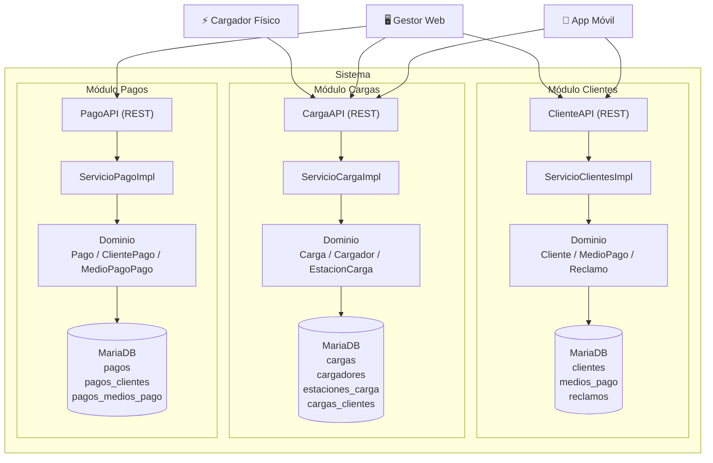
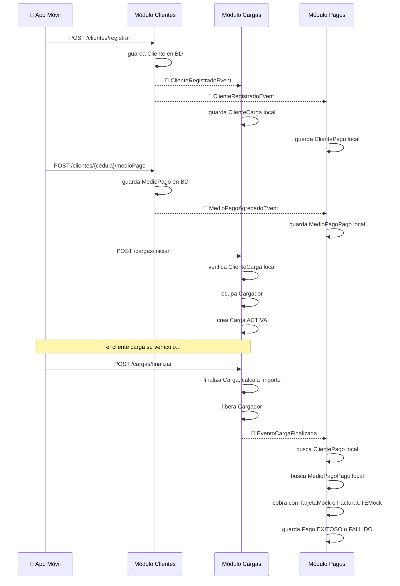
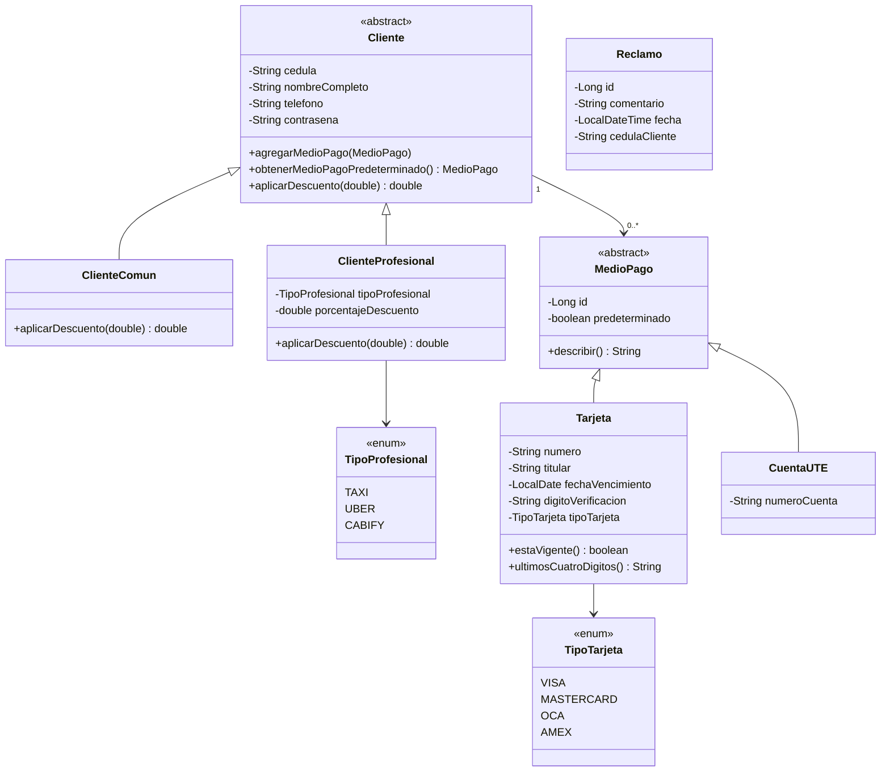
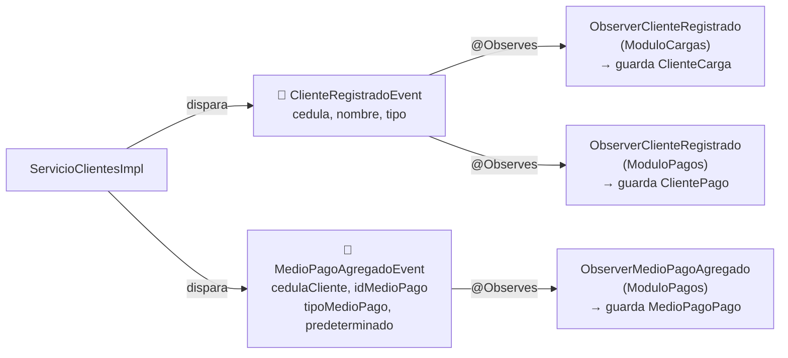
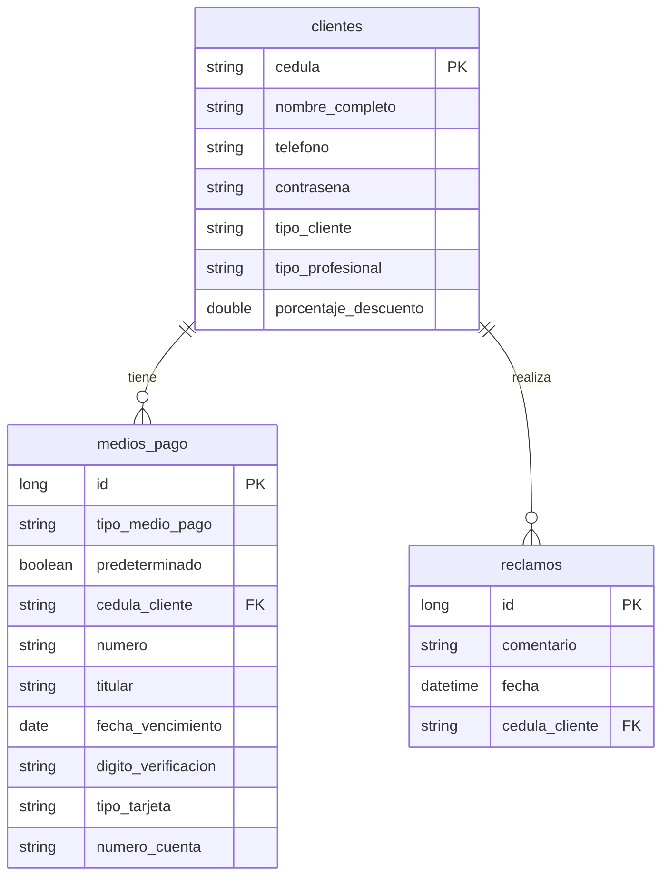

# Taller Java — Iteración 1
## Sistema de Gestión de Movilidad Eléctrica

---

## Introducción

Sistema de gestión de movilidad eléctrica desarrollado con Jakarta EE 10, JPA/Hibernate y MariaDB.
Permite gestionar clientes, estaciones de carga, cargas de vehículos eléctricos y pagos,
siguiendo una arquitectura modular con bajo acoplamiento entre módulos.

---

## Decisiones de diseño

- **Modularización**: el sistema se divide en tres módulos principales — Clientes, Cargas y Pagos.
  Cada módulo es una separación lógica independiente dentro de la aplicación.

- **Bajo acoplamiento entre módulos**: los módulos se comunican exclusivamente mediante eventos CDI.
  Ningún módulo importa clases de dominio de otro módulo.
  Cada módulo tiene sus propias clases de dominio y su propio conjunto de tablas en la base de datos.

- **Separación en capas**: cada módulo sigue una arquitectura limpia con capas bien definidas —
  dominio, aplicación, interfaz e infraestructura.

- **Priorización de lógica de negocio**: la capa de dominio es el centro de la arquitectura.
  No conoce ninguna capa externa — ni eventos, ni HTTP, ni base de datos.
  Solo contiene reglas de negocio.

- **Persistencia**: MariaDB con JPA/Hibernate. Cada módulo gestiona sus propias tablas.

- **Inyección de dependencias**: CDI (Contexts and Dependency Injection) de Jakarta EE.
  El contenedor resuelve las dependencias en tiempo de ejecución.

---

## Arquitectura general



---

## Comunicación entre módulos — Eventos CDI

Los módulos no se llaman directamente. Se comunican mediante eventos CDI.
Cada módulo guarda una copia local de los datos que necesita de otros módulos.



---

## Estructura de paquetes

```mermaid
graph TD
    src["src/main/java/org/tallerjava"]

    src --> MC["ModuloCliente/"]
    src --> MCA["ModuloCarga/"]
    src --> MP["ModuloPago/"]
    src --> INF["infraestructura/\nconfiguracion/\nApplicationConfig.java"]

    MC --> MC_AP["aplicacion/\nServicioClientes.java\nimpl/ServicioClientesImpl.java"]
    MC --> MC_DO["dominio/\nCliente.java\nClienteComun.java\nClienteProfesional.java\nMedioPago.java\nTarjeta.java\nCuentaUTE.java\nReclamo.java\nrepositorios/"]
    MC --> MC_IN["infraestructura/\npersistencia/\nClienteRepositorioImpl.java"]
    MC --> MC_IF["Interface/\nevento/out/\nClienteRegistradoEvent.java\nPublicadorEventoCliente.java\nMedioPagoAgregadoEvent.java\nPublicadorEventoMedioPago.java\nremota/rest/\nClienteAPI.java\ndto/\nlocal/\nInterfaceLocalCliente.java"]

    MCA --> MCA_AP["aplicacion/\nServicioCarga.java\nimpl/ServicioCargaImpl.java"]
    MCA --> MCA_DO["dominio/\nCarga.java\nCargador.java\nEstacionCarga.java\nClienteCarga.java\nrepositorios/"]
    MCA --> MCA_IN["infraestructura/\npersistencia/\nCargaRepositorioImpl.java\nCargadorRepositorioImpl.java\nEstacionRepositorioImpl.java\nClienteCargaRepositorioImpl.java"]
    MCA --> MCA_IF["Interface/\nevento/in/\nObserverClienteRegistrado.java\nevento/out/\nEventoCargaFinalizada.java\nPublicadorEventoCarga.java\nremota/rest/\nCargaAPI.java\ndto/\nlocal/\nInterfaceLocalCarga.java"]

    MP --> MP_AP["aplicacion/\nServicioPago.java\nimpl/ServicioPagoImpl.java"]
    MP --> MP_DO["dominio/\nPago.java\nEstadoPago.java\nClientePago.java\nMedioPagoPago.java\nrepositorios/"]
    MP --> MP_IN["infraestructura/\npersistencia/\nPagoRepositorioImpl.java\nClientePagoRepositorioImpl.java\nMedioPagoPagoRepositorioImpl.java\nexternos/\nTarjetaMock.java\nFacturaUTEMock.java"]
    MP --> MP_IF["Interface/\nevento/in/\nObserverClienteRegistrado.java\nObserverMedioPagoAgregado.java\nObserverCargaFinalizada.java\nremota/rest/\nPagoAPI.java\ndto/\nlocal/\nInterfaceLocalPago.java"]
```



---

## Módulo Clientes

### Modelo de dominio



### Casos de uso

| Caso de uso | Consumidor | Descripción |
|-------------|------------|-------------|
| `registrarCliente` | App móvil | Registra un nuevo cliente. Hashea la contraseña con BCrypt. Dispara `ClienteRegistradoEvent` |
| `altaMedioPago` | App móvil | Agrega un medio de pago al cliente. El primero queda como predeterminado. Dispara `MedioPagoAgregadoEvent` |
| `obtenerClientes` | Gestor web | Devuelve todos los clientes registrados |
| `realizarReclamo` | App móvil | Registra un reclamo del cliente con comentario y fecha |

### Eventos que produce



### Endpoints REST

| Método | URL | Body | Respuesta |
|--------|-----|------|-----------|
| `POST` | `/api/clientes/registrar` | `ClienteDTO` | `201` id del cliente |
| `POST` | `/api/clientes/{cedula}/medioPago` | `MedioPagoDTO` | `200` ok |
| `GET` | `/api/clientes` | — | `200` lista de clientes |
| `POST` | `/api/clientes/{cedula}/reclamos` | String comentario | `201` id del reclamo |

### Ejemplos curl

**Registrar cliente común:**
```bash
curl -X POST http://localhost:8080/TallerJavaEquipo6/api/clientes/registrar \
  -H "Content-Type: application/json" \
  -d '{
    "cedula": "12345678",
    "nombreCompleto": "Juan Perez",
    "telefono": "099123456",
    "contrasena": "clave123",
    "tipo": "COMUN"
  }'
```

**Registrar cliente profesional:**
```bash
curl -X POST http://localhost:8080/TallerJavaEquipo6/api/clientes/registrar \
  -H "Content-Type: application/json" \
  -d '{
    "cedula": "98765432",
    "nombreCompleto": "Maria Garcia",
    "telefono": "098456789",
    "contrasena": "clave456",
    "tipo": "PROFESIONAL",
    "tipoProfesional": "TAXI",
    "porcentajeDescuento": 15.0
  }'
```

**Agregar tarjeta:**
```bash
curl -X POST http://localhost:8080/TallerJavaEquipo6/api/clientes/12345678/medioPago \
  -H "Content-Type: application/json" \
  -d '{
    "tipo": "TARJETA",
    "numero": "4111111111111111",
    "titular": "Juan Perez",
    "fechaVencimiento": "2027-12-01",
    "digitoVerificacion": "123",
    "tipoTarjeta": "VISA"
  }'
```

**Agregar cuenta UTE:**
```bash
curl -X POST http://localhost:8080/TallerJavaEquipo6/api/clientes/12345678/medioPago \
  -H "Content-Type: application/json" \
  -d '{
    "tipo": "UTE",
    "numeroCuenta": "UTE-987654"
  }'
```

**Realizar reclamo:**
```bash
curl -X POST http://localhost:8080/TallerJavaEquipo6/api/clientes/12345678/reclamos \
  -H "Content-Type: application/json" \
  -d '"El cargador no funciona"'
```

**Obtener todos los clientes:**
```bash
curl http://localhost:8080/TallerJavaEquipo6/api/clientes
```

---

## Tablas en base de datos — Módulo Clientes



---

## Tecnologías utilizadas

| Tecnología | Versión | Uso |
|------------|---------|-----|
| Jakarta EE | 10 | Plataforma base |
| WildFly | 27 | Servidor de aplicaciones |
| JPA / Hibernate | 6 | Persistencia |
| MariaDB | — | Base de datos |
| CDI | 4 | Inyección de dependencias y eventos |
| JAX-RS | 3.1 | API REST |
| BCrypt | — | Hash de contraseñas |
| JUnit | 5 | Tests |

---

## Cómo ejecutar

```bash
# Levantar el servidor en modo desarrollo
mvn clean package wildfly:dev

# El servidor queda disponible en
http://localhost:8080/TallerJavaEquipo6
```

