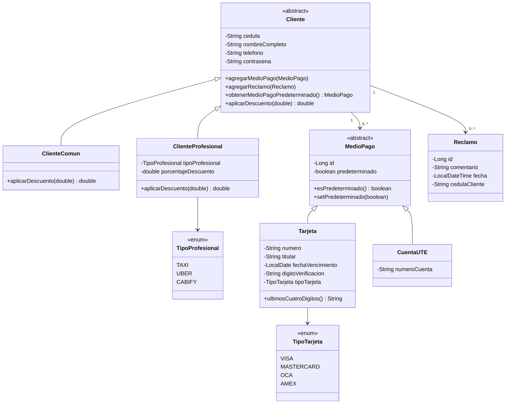
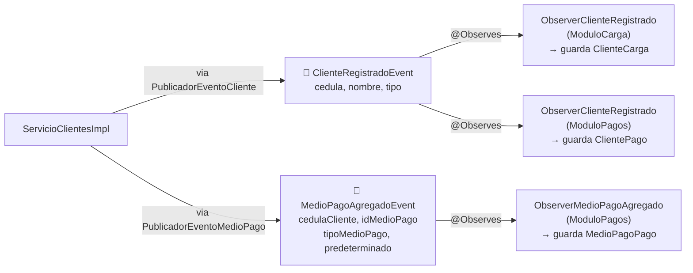
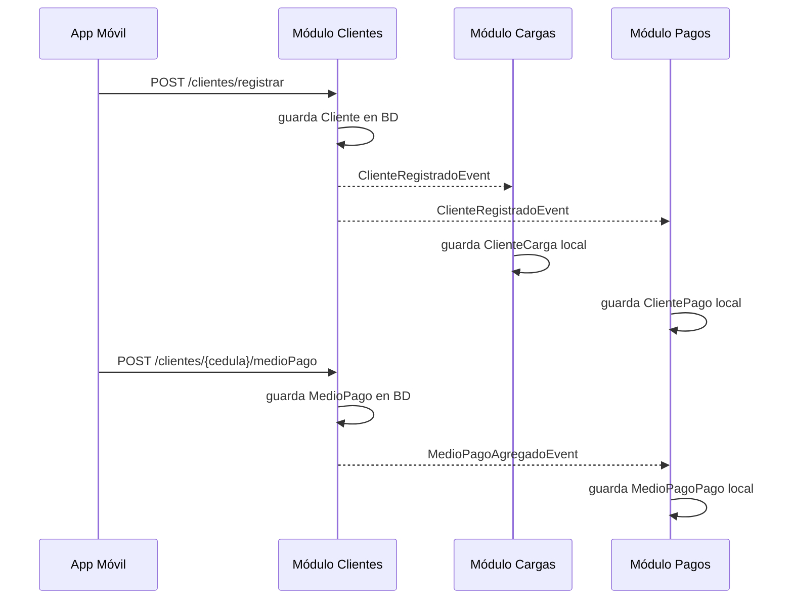

# Sistema de Gestión de Movilidad Eléctrica

> **Taller Java 2026 — UTEC Maldonado**  
> Iteración 1: Lógica de Negocio

---

## Índice

1. [Descripción General](#descripción-general)
2. [Decisiones de Diseño](#decisiones-de-diseño)
3. [Arquitectura del Sistema](#arquitectura-del-sistema)
4. [Estructura de Paquetes](#estructura-de-paquetes)
5. [Módulo Clientes](#módulo-clientes)
6. [Módulo Cargas](#módulo-cargas)
7. [Módulo Pagos](#módulo-pagos)
8. [Comunicación entre Módulos](#comunicación-entre-módulos)

---

## Descripción General

El sistema permite gestionar la carga de vehículos eléctricos. Los clientes se registran, asocian medios de pago y utilizan estaciones de carga. Al finalizar una carga el cobro se realiza de forma automática, interactuando con los sistemas externos de pago (tarjetas o facturación UTE).

El backend está implementado como un **monolito modular** sobre **Jakarta EE**, siguiendo lineamientos de diseño que permiten una futura migración a microservicios con mínimo impacto. Cada módulo posee su propio esquema de base de datos y se comunica con los demás únicamente a través de interfaces o eventos CDI, garantizando bajo acoplamiento.

> **Referencias de diseño:**
> - [Jakarta EE — CDI Specification](https://jakarta.ee/specifications/cdi/)
> - [Quarkus — Dependency Injection](https://quarkus.io/guides/cdi)
> - [Microservices Patterns — Sam Newman](https://samnewman.io/books/building_microservices/)

---

## Decisiones de Diseño

- **Tres módulos principales**: Clientes, Cargas y Pagos. Cada uno es independiente y tiene
  sus propias clases de dominio y sus propias tablas en la base de datos.

- **Los módulos no se llaman directamente**: se comunican solo por eventos CDI.
  Si el módulo Clientes necesita avisarle algo al módulo Pagos, dispara un evento.
  Ningún módulo importa clases de dominio de otro.

- **Capas bien separadas dentro de cada módulo**: dominio, aplicación, interfaz e infraestructura.
  El dominio no sabe nada de HTTP, ni de base de datos, ni de eventos. Solo tiene lógica de negocio.

- **Persistencia con JPA/Hibernate sobre MariaDB**. Cada módulo maneja sus propias tablas.

- **Inyección de dependencias con CDI**. El contenedor de Jakarta EE resuelve las dependencias
  en tiempo de ejecución, sin que las clases se instancien entre sí manualmente.

---

## Arquitectura del Sistema

### Diagrama de Sistemas / Subsistemas

```
┌─────────────┐         ┌──────────────────────────────────────────────┐        ┌────────────────────┐
│  Hardware   │         │                   Backend                    │        │  Sistemas Externos │
│             │         │                                              │        │                    │
│  Cargador ──┼────────►│  ┌──────────────────────────────────────┐   │───────►│  Medio de Pago     │
│  (software) │         │  │          «Core» GestorMovilidad      │   │        │  (Visa/Master/etc) │
└─────────────┘         │  │                                      │   │───────►│  Facturación UTE   │
                        │  │  ┌─────────┐ ┌────────┐ ┌────────┐  │   │        └────────────────────┘
┌─────────────┐         │  │  │Clientes │ │ Cargas │ │ Pagos  │  │   │
│  Frontend   │         │  │  └─────────┘ └────────┘ └────────┘  │   │
│             │         │  └──────────────────────────────────────┘   │
│  App Móvil ─┼────────►│                                              │
│  Gestor Web─┼────────►│                                              │
└─────────────┘         └──────────────────────────────────────────────┘
```

### Diagrama de Capas (por módulo)

Cada módulo sigue la siguiente estructura de capas, de menor a mayor nivel de abstracción:

```
┌──────────────────────────────────────────────────────────────┐
│                     Infraestructura                          │  ← Código transversal, persistencia JPA
├──────────────────────────────────────────────────────────────┤
│                       Interface                              │  ← APIs REST, eventos CDI, interfaces locales
├──────────────────────────────────────────────────────────────┤
│                      Aplicación                              │  ← Casos de uso / servicios
├──────────────────────────────────────────────────────────────┤
│                       Dominio                                │  ← Entidades y lógica de negocio
└──────────────────────────────────────────────────────────────┘
```

> La justificación de este diseño en capas responde al patrón **Layered Architecture**, donde cada capa sólo depende de la inmediatamente inferior, facilitando pruebas unitarias por capa y la eventual separación en servicios independientes.  
> Referencia: [Clean Architecture — Robert C. Martin](https://blog.cleancoder.com/uncle-bob/2012/08/13/the-clean-architecture.html)

---

## Estructura de Paquetes

```
src/main/java/org/tallerjava/
├── ModuloCliente/
│   ├── dominio/
│   │   ├── Cliente.java
│   │   ├── ClienteComun.java
│   │   ├── ClienteProfesional.java
│   │   ├── MedioPago.java
│   │   ├── Tarjeta.java
│   │   ├── CuentaUTE.java
│   │   ├── Reclamo.java
│   │   └── repositorio/
│   │       └── ClienteRepositorio.java
│   ├── aplicacion/
│   │   ├── ServicioClientes.java
│   │   └── impl/
│   │       └── ServicioClientesImpl.java
│   ├── Interface/
│   │   ├── local/
│   │   │   └── InterfaceLocalCliente.java
│   │   └── evento/
│   │       └── out/
│   │           ├── PublicadorEventoCliente.java
│   │           ├── PublicadorEventoMedioPago.java
│   │           ├── ClienteRegistradoEvent.java
│   │           └── MedioPagoAgregadoEvent.java
│   └── infraestructura/
│       └── persistencia/
│           └── ClienteRepositorioImpl.java
│
├── ModuloCarga/
│   ├── dominio/
│   │   ├── Carga.java
│   │   ├── Cargador.java
│   │   ├── EstacionCarga.java
│   │   ├── ClienteCarga.java
│   │   ├── EstadoCarga.java
│   │   ├── EstadoCargador.java
│   │   └── repositorio/
│   │       ├── CargaRepositorio.java
│   │       ├── CargadorRepositorio.java
│   │       ├── ClienteCargaRepositorio.java
│   │       └── EstacionRepositorio.java
│   ├── aplicacion/
│   │   ├── ServicioCarga.java
│   │   └── impl/
│   │       └── ServicioCargaImpl.java
│   ├── Interface/
│   │   ├── remota/rest/
│   │   │   └── CargaAPI.java
│   │   └── evento/in/
│   │       └── ObserverClienteRegistrado.java
│   └── infraestructura/
│       └── persistencia/
│           └── EstacionRepositorioImpl.java
│
└── ModuloPago/
    ├── dominio/
    │   ├── Pago.java
    │   ├── ClientePago.java
    │   ├── EstadoPago.java
    │   └── repositorio/
    │       ├── PagoRepositorio.java
    │       └── ClientePagoRepositorio.java
    ├── aplicacion/
    │   ├── ServicioPago.java
    │   └── impl/
    │       └── ServicioPagoImpl.java
    ├── Interface/
    │   ├── local/
    │   │   └── InterfaceLocalPago.java
    │   ├── remota/rest/
    │   │   └── PagoAPI.java
    │   └── evento/in/
    │       └── ObserverClienteRegistrado.java
    └── infraestructura/
        └── persistencia/
            └── PagoRepositorioImpl.java
```

---

## Módulo Clientes


### Modelo de dominio



### Casos de uso

| Caso de uso | Consumidor | Qué hace |
|-------------|------------|----------|
| `registrarCliente` | App móvil | Registra un cliente nuevo, hashea la contraseña y avisa a los otros módulos |
| `altaMedioPago` | App móvil | Agrega un medio de pago al cliente. El primero que se agrega queda como predeterminado |
| `obtenerClientes` | Gestor web | Devuelve la lista de todos los clientes registrados |
| `realizarReclamo` | App móvil | Guarda un reclamo del cliente con su comentario y la fecha del sistema |

### Cómo se implementó cada caso de uso

**registrarCliente**

La API recibe un `ClienteDTO`. El DTO tiene un método `build()` que decide qué subclase
crear: si el tipo es `PROFESIONAL` crea un `ClienteProfesional` con su descuento,
si es `COMUN` crea un `ClienteComun`. Esta decisión vive en el DTO para no ensuciar el servicio.

El `tipoProfesional` llega como String y se convierte a mayúsculas antes de pasarlo a
`TipoProfesional.valueOf()`, para que no falle si viene en minúscula.

Antes de guardar, el servicio verifica que no exista otro cliente con esa cédula.
Si ya existe, lanza `IllegalStateException` y la API responde `400 BAD REQUEST`.
La contraseña se hashea con BCrypt, nunca se guarda en texto plano.

Al terminar, se dispara `ClienteRegistradoEvent` con la cédula, nombre y tipo del cliente
(solo datos primitivos, sin objetos de dominio) para que Cargas y Pagos guarden su copia.

**altaMedioPago**

La API recibe un `MedioPagoDTO`. El `build()` del DTO crea la subclase correcta:
`Tarjeta` o `CuentaUTE` según el campo `tipo`.

La lógica de cuál es el predeterminado está en el dominio, en `Cliente.agregarMedioPago()`:
si la lista de medios de pago está vacía, el nuevo medio queda como predeterminado automáticamente.
El servicio no necesita saber nada de eso.

Al responder, el número de tarjeta se enmascara con `**** **** **** XXXX` usando
`tarjeta.ultimosCuatroDigitos()`. El dígito de verificación nunca se incluye en la respuesta.

Se dispara `MedioPagoAgregadoEvent` con el id técnico, el tipo y si es predeterminado.
Nunca se manda el número de tarjeta en el evento.

**obtenerClientes**

El servicio devuelve los objetos `Cliente` de la base de datos, pero la API los convierte
a `ClienteDTO` con `ClienteDTO.convertirDTO(cliente)` antes de responder. Eso hace que
la contraseña hasheada nunca salga en la respuesta HTTP aunque esté en el objeto de dominio.

**realizarReclamo**

La API recibe un `ReclamoDTO` con el comentario. El servicio crea un `Reclamo` nuevo
pasando el comentario y la cédula — la fecha la pone el constructor con `LocalDateTime.now()`,
el cliente no puede manipularla. Luego llama a `cliente.agregarReclamo()` y persiste.

Si la cédula no existe, lanza `IllegalArgumentException` y la API devuelve `400 BAD REQUEST`.

### Eventos que produce



### Diagrama de secuencia — Flujo de eventos



### Endpoints REST

| Método | URL | Body | Respuesta |
|--------|-----|------|-----------|
| `POST` | `/api/clientes/registrar` | `ClienteDTO` | `201` cédula del cliente |
| `POST` | `/api/clientes/{cedula}/medioPago` | `MedioPagoDTO` | `200` mensaje de confirmación |
| `GET` | `/api/clientes` | — | `200` lista de clientes (sin contraseña) |
| `POST` | `/api/clientes/{cedula}/reclamos` | `ReclamoDTO` | `201` mensaje de confirmación |

### Ejemplos curl

**Registrar cliente común:**
```bash
curl -X POST http://localhost:8080/TallerJavaEquipo6/api/clientes/registrar \
  -H "Content-Type: application/json" \
  -d '{
    "cedula": "12345678",
    "nombreCompleto": "Juan Perez",
    "telefono": "099123456",
    "contrasena": "clave123",
    "tipo": "COMUN"
  }'
```

**Registrar cliente profesional:**
```bash
curl -X POST http://localhost:8080/TallerJavaEquipo6/api/clientes/registrar \
  -H "Content-Type: application/json" \
  -d '{
    "cedula": "98765432",
    "nombreCompleto": "Maria Garcia",
    "telefono": "098456789",
    "contrasena": "clave456",
    "tipo": "PROFESIONAL",
    "tipoProfesional": "TAXI",
    "porcentajeDescuento": 15.0
  }'
```

**Agregar tarjeta:**
```bash
curl -X POST http://localhost:8080/TallerJavaEquipo6/api/clientes/12345678/medioPago \
  -H "Content-Type: application/json" \
  -d '{
    "tipo": "TARJETA",
    "numero": "4111111111111111",
    "titular": "Juan Perez",
    "fechaVencimiento": "2027-12-01",
    "digitoVerificacion": "123",
    "tipoTarjeta": "VISA"
  }'
```

**Agregar cuenta UTE:**
```bash
curl -X POST http://localhost:8080/TallerJavaEquipo6/api/clientes/12345678/medioPago \
  -H "Content-Type: application/json" \
  -d '{
    "tipo": "UTE",
    "numeroCuenta": "UTE-987654"
  }'
```

**Realizar reclamo:**
```bash
curl -X POST http://localhost:8080/TallerJavaEquipo6/api/clientes/12345678/reclamos \
  -H "Content-Type: application/json" \
  -d '{"comentario": "El cargador no funciona"}'
```

**Obtener todos los clientes:**
```bash
curl http://localhost:8080/TallerJavaEquipo6/api/clientes
```

---

## Módulo Cargas

### Responsabilidad

Gestiona el ciclo de vida completo de una carga eléctrica: inicio, consulta en tiempo real, histórico y finalización. Además administra la infraestructura de estaciones y cargadores. Al finalizar una carga, delega el cobro al **Módulo Pagos** a través de su interfaz local.

### Diagrama UML — Dominio

```
  ┌──────────────────────────────┐           ┌──────────────────────────────┐
  │        EstacionCarga         │ 1    1..*  │           Cargador           │
  ├──────────────────────────────┤────────────┤──────────────────────────────┤
  │ - idEstacion: long           │  contiene  │ - idCargador: long           │
  │ - descripcion: String        │            │ - tipo: TipoCargador         │
  │ - calle: String              │            │ - tieneCable: boolean        │
  │ - departamento: String       │            │ - tipoConector: TipoConector │
  │ - longitud: int              │            │ - estado: EstadoCargador     │
  │ - latitud: int               │            │ - tiempoEstimadoFin          │
  └──────────────────────────────┘            │ - potenciaMinima: int        │
                                              └──────────────┬───────────────┘
                                                             │ 0..1 registra
                                                             ▼
  ┌─────────────────────────┐            ┌───────────────────────────────────┐
  │       ClienteCarga      │            │               Carga               │
  ├─────────────────────────┤            ├───────────────────────────────────┤
  │ - cedula: String        │ 0..* realiza│ - idCarga: long                  │
  │ - nombre: String        │────────────│ - fecha: LocalDate                │
  │ - tipo: String          │            │ - horaInicio: LocalDateTime       │
  └─────────────────────────┘            │ - horaFin: LocalDateTime          │
                                         │ - importeTotal: float             │
                                         │ - recargoPorDemora: float         │
                                         │ - porcentajeAvance: int           │
                                         │ - estado: EstadoCarga             │
                                         │ - idCargador: long                │
                                         │ - idMedioPago: long               │
                                         └───────────────────────────────────┘
```

**Estados del cargador:** `DISPONIBLE` → `OCUPADO` → `DISPONIBLE` / `FUERA_DE_SERVICIO`

**Estados de la carga:** `INICIADA` → `COMPLETADA`

### Interfaz de Servicio (`ServicioCarga`)

| Método | Consumidor | Descripción |
|--------|-----------|-------------|
| `iniciarCarga(String cedulaCliente, long idCargador, long idMedioPago) : long` | App móvil | Inicia una carga para el cliente indicado en el cargador especificado. Valida que el cliente exista en el módulo, que no tenga una carga activa y que el cargador esté `DISPONIBLE`. Retorna el `idCarga` generado. Cambia el estado del cargador a `OCUPADO`. |
| `verCargaActual(String cedulaCliente) : Carga` | App móvil | Retorna la carga en estado `INICIADA` del cliente, o `null` si no existe carga activa. |
| `verHistorico(String cedulaCliente, LocalDate fechaIni, LocalDate fechaFin) : List<Carga>` | App móvil | Retorna el historial de cargas completadas del cliente en el rango de fechas indicado. |
| `finalizarCarga(long idCargador, float consumoKwh, int minutosDemora)` | Cargador (hardware) | Invocado por el software del cargador cuando el cable es desconectado. Calcula el importe de energía (`consumoKwh × 5.0`) y el recargo por demora (`minutosDemora × 2.0`). Persiste la carga como `COMPLETADA`, libera el cargador y delega el cobro a `InterfaceLocalPago.pagarCarga()`. |
| `altaEstacion(EstacionCarga estacion) : long` | Gestor web | Da de alta una nueva estación de carga. Retorna el `idEstacion` generado. |
| `altaCargador(long idEstacion, Cargador cargador) : long` | Gestor web | Da de alta un cargador asociado a una estación existente. Valida que la estación exista. Retorna el `idCargador` generado. |
| `obtenerEstaciones() : List<EstacionCarga>` | App móvil | Retorna todas las estaciones de carga registradas con sus cargadores. |

### Tarifas aplicadas

| Concepto | Tarifa |
|----------|--------|
| Energía | $5.00 por kWh |
| Demora por no desconexión | $2.00 por minuto |

### Diagrama de Secuencia — Proceso Principal

```
Cliente         ModuloCarga       Cargador         ModuloPago
   │                │                │                  │
   │─iniciarCarga()─►                │                  │
   │                │──iniciar()────►│                  │
   │                │◄─────ok────────│                  │
   │                │                │                  │
   │                │   ... tiempo después ...           │
   │                │                │                  │
   │                │◄─finalizarCarga()─────────────────│
   │                │                │                  │
   │                │────────────────────pagarCarga()──►│
   │                │◄───────────────────ok pago────────│
```

---

## Módulo Pagos

### Responsabilidad

Gestiona el registro y consulta de pagos realizados por los clientes. Expone la `InterfaceLocalPago` que consume el Módulo Cargas al finalizar una carga. Opera sobre su propio contexto de cliente (`ClientePago`) que se sincroniza mediante eventos.

### Dominio

```
  ┌────────────────────────┐          ┌────────────────────────────┐
  │       ClientePago      │  0..*    │            Pago            │
  ├────────────────────────┤──────────┤────────────────────────────┤
  │ - cedula: String       │  tiene   │ - idPago: long             │
  │ - nombre: String       │          │ - cedula: String           │
  │ - tipo: String         │          │ - importe: int (centavos)  │
  └────────────────────────┘          │ - idMedioPago: long        │
                                      │ - estado: EstadoPago       │
                                      │ - fecha: LocalDateTime     │
                                      └────────────────────────────┘
```

### Interfaz de Servicio (`ServicioPago`)

| Método | Consumidor | Descripción |
|--------|-----------|-------------|
| `altaPago(String cedula, Pago pago)` | Interno | Persiste un nuevo pago y lo asocia al cliente en el repositorio local del módulo. |
| `consultarPagos(String cedula, LocalDate fechaIni, LocalDate fechaFin) : List<Pago>` | Gestor web | Retorna la lista de pagos del cliente en el rango de fechas indicado. Permite conciliar los pagos contra el histórico de cargas del Módulo Cargas. |

### Interfaz Local (`InterfaceLocalPago`)

Implementada por `ServicioPagoImpl`, consumida directamente por el Módulo Cargas mediante inyección CDI:

| Método | Descripción |
|--------|-------------|
| `pagarCarga(String cedula, int importe, Long idMedioPago) : boolean` | Registra el cobro de una carga. El importe se recibe en centavos. Retorna `true` si el pago fue procesado correctamente. En esta iteración actúa como stub; en una iteración futura integrará con los sistemas externos (Visa/Master y Facturación UTE). |

### API REST — Endpoints disponibles

| Verbo | Path | Descripción |
|-------|------|-------------|
| `GET` | `/pagos/{cedula}/listarPagos?fechaIni=&fechaFin=` | Consulta pagos de un cliente en el rango de fechas. |

---

## Comunicación entre Módulos

Los módulos se comunican de dos formas, priorizando siempre el bajo acoplamiento:

**1. Eventos CDI (asincrónico, preferido)**  
Cuando la operación no requiere retorno de valores, se utiliza el sistema de eventos CDI (`jakarta.enterprise.event.Event`). El módulo productor publica el evento sin conocer quién lo consume.

```
ModuloCliente ──► ClienteRegistradoEvent ──► ModuloCarga  (ObserverClienteRegistrado)
                                         └──► ModuloPago   (ObserverClienteRegistrado)
```

**2. Interfaces locales (sincrónico, cuando se requiere valor de retorno)**  
Cuando el resultado de la llamada es necesario para continuar el flujo (como el cobro al finalizar una carga), se utiliza una interfaz local que el módulo consumidor inyecta mediante CDI.

```
ModuloCarga ──► InterfaceLocalPago.pagarCarga() ──► ServicioPagoImpl
```

> Esta estrategia de comunicación está alineada con el patrón **Anti-Corruption Layer** y el principio de **módulos desacoplados**, base para una futura transición a microservicios.  
> Referencia: [Domain-Driven Design — Eric Evans, Cap. 14](https://www.domainlanguage.com/ddd/)

### Restricción de diseño

> No está permitida la comunicación directa entre clases de distintos módulos fuera de las interfaces declaradas en el paquete `Interface`. Cada módulo mantiene su propio repositorio de datos (tablas separadas dentro de la misma base de datos).

---

*Documentación para la Iteración 1 — Taller Java 2026, UTEC Maldonado.*
